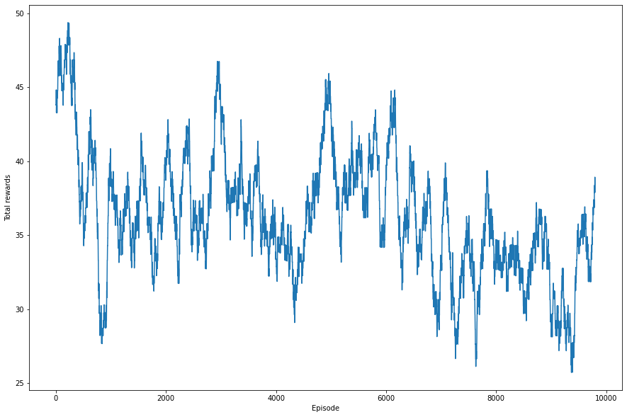
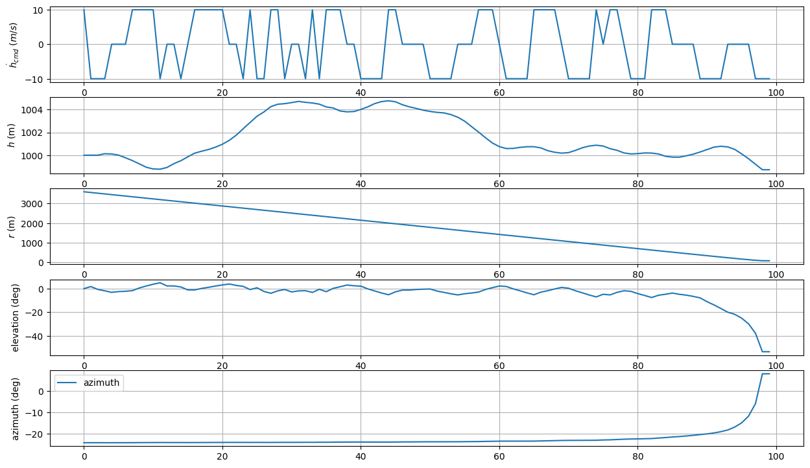
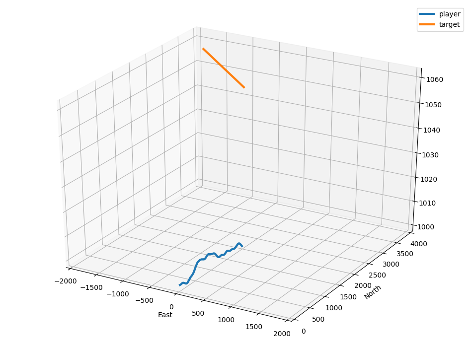
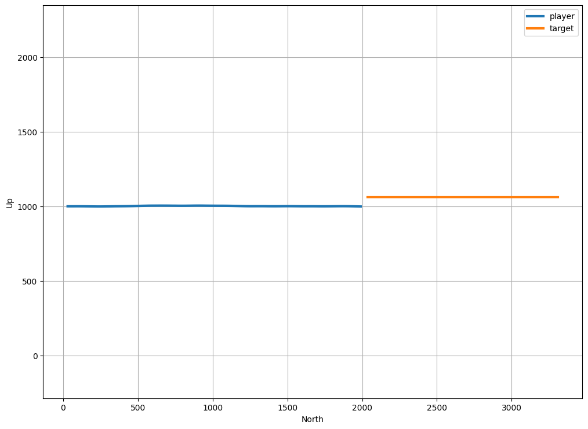

# min_dist_avoid
이전의 최소거리 reward를 적용했던것을 다시 적용하여 실험해보았다. 회피 시에 적용된 reward는 다음과 같다.
 
- 회피 시 : 

 
 # 구현 결과
## Rewards after 10000 episodes (Moving average 200)

## Results after 10000 episodes (hdot_cmd, h, r, elev, azim)

## 3D plot

## Height plot

 
 여전히 수렴이 잘 진행되지 않았다. hcmd를 줄때의 패널티 reward term을 매 스텝마다 주지 말고, 아예 에피소드 종료시에 합산하여 적용시켜보려 한다.
 
 [12.reward_retry](../12.reward_retry)
