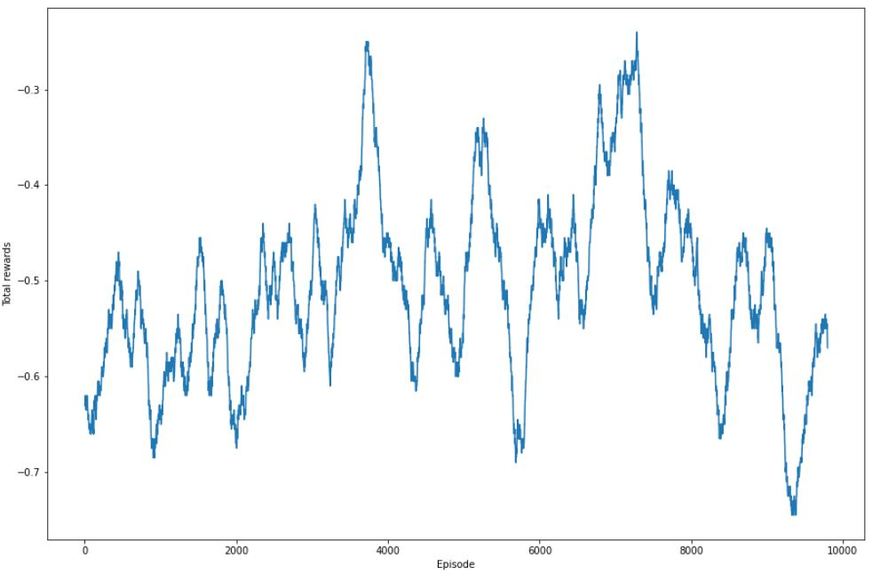
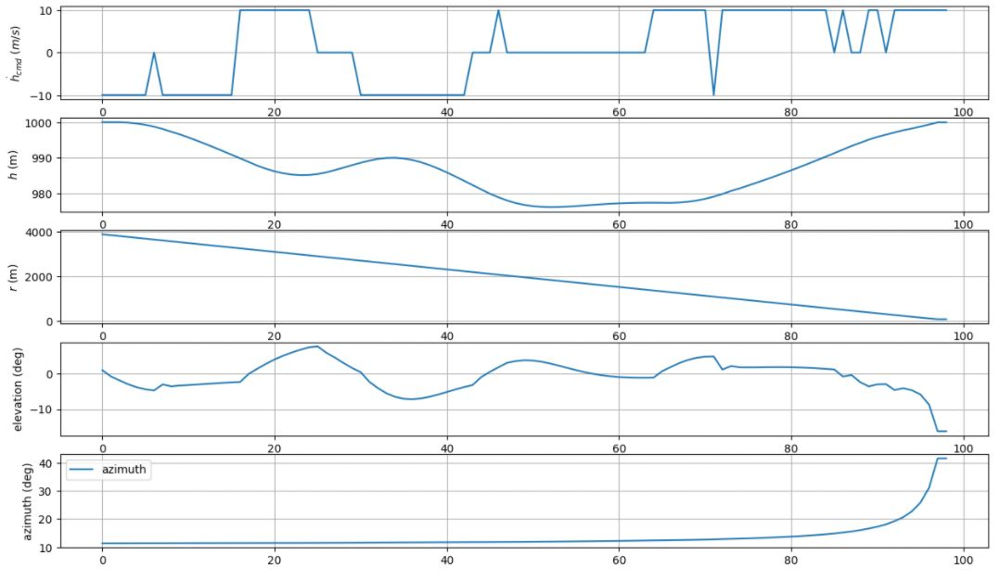
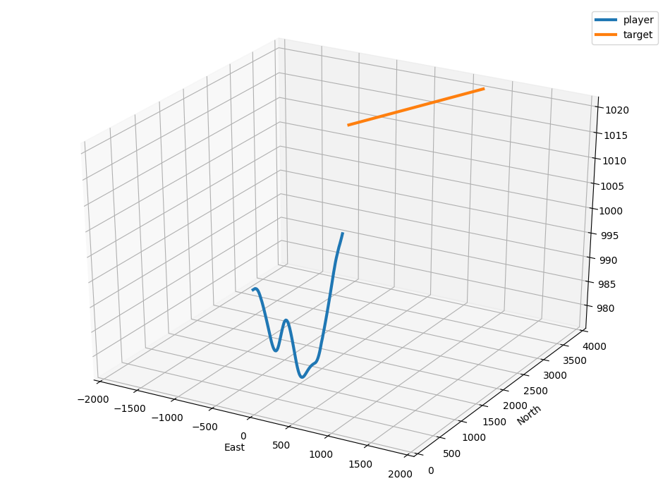
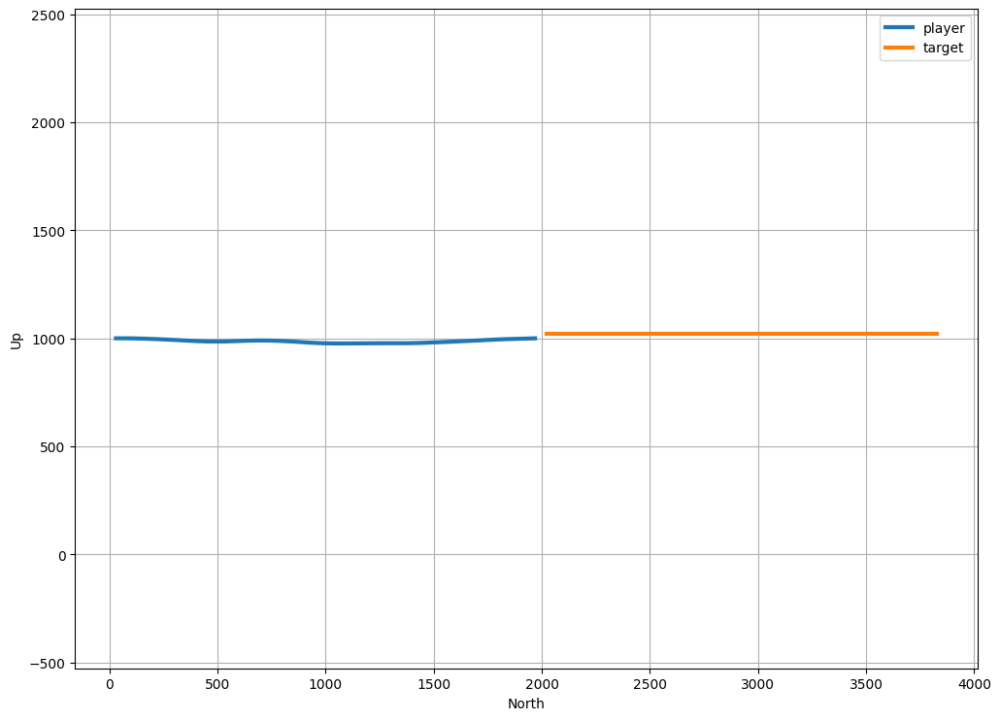

# down_cmd_dqn
이전에는 고도 변화 명령과 관련해서만 Reward를 줬다면, 이번에는 충돌에 관해서만 Reward를 제공하였다. 회피시에는 Reward를 0으로 두고, 충돌시에는 -1로 두었다.
또한 수렴의 안정성을 위해, 단일 환경(아래로 회피하는 환경)에 대해서만 실험을 진행하였다. 단일 환경은 상대기가 늘 본체보다 높은 고도에서 출발하도록 설계하였다.

# 구현 결과

## Rewards after 10000 episodes (Moving average 200)

## Results after 10000 episodes (hdot_cmd, h, r, elev, azim)

## 3D plot

## Height plot

Reward와 Results 사진을 보면, 10000 episodes를 진행했음에도 수렴이 명확하게 되지 않았다. 따라서 이전의 non_cmd 실험에서 처럼 매 스텝별로 reward를 제공해보려 한다.

[4.down_cmd_dqn_step_reward](../4.down_cmd_dqn_step_reward)
