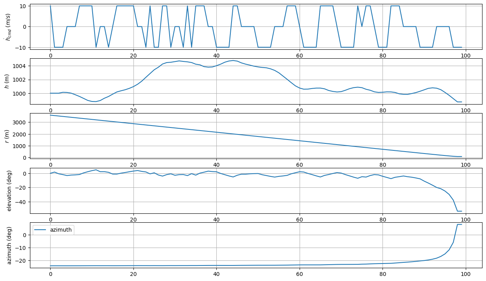
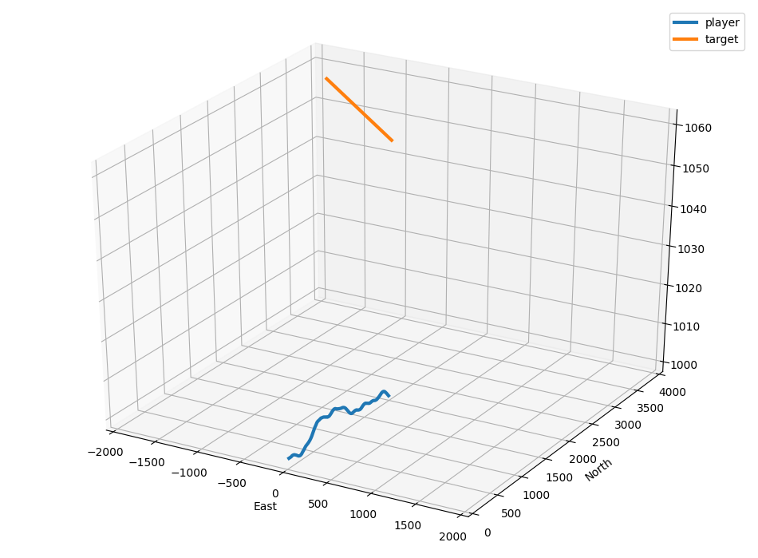

# down_cmd_dqn_step_reward
이전의 문제점을 해결하기 위해 새롭게 reward를 설정하였다. reward 변경내용은 다음과 같다.
- 충돌시 -1, 회피시 0의 reward를 반환 (에피소드 종료시에만 적용) -> 충돌하지 않았을 경우 매 스텝마다 1씩 반환, 충돌시 -100반환

# 구현 결과

## Rewards after 10000 episodes (Moving average 200)

## Results after 10000 episodes (hdot_cmd, h, r, elev, azim)

## 3D plot

## Height plot

결과로 미루어 보아 여전히 수렴이 잘 진행되지 않았다. 시야에서 벗어날경우 바로 시나리오가 종료되어, 
reward가 누적되는 경향을 따라가기 어려운게 아닐까 하여 매 에피소드마다 시나리오의 길이를 늘려서 다시 실험해보려 한다.

[5.down_cmd_dqn_long_sim](../5.down_cmd_dqn_long_sim)
