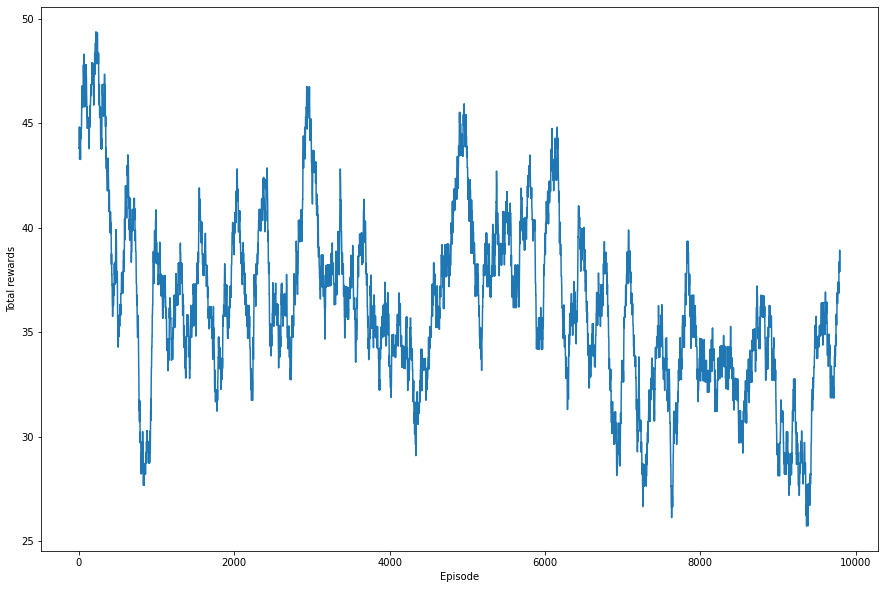

# non_cmd_dqn_step_reward
기존의 시나리오가 시야를 벗어나면 바로 종료되어 대부분의 시나리오가 길이100(10초) 언저리에서 종료되었다. 따라서 이부분을 다음과 같이 수정하여 실험하였다.
- 시나리오 종료 조건 : 목표 항공기가 본체의 시야에서 벗어났을때 -> 시뮬레이션 지속시간이 20초 이상이고, 목표 항공기가 본체의 시야에서 벗어났을때

# 구현 결과

## Rewards after 10000 episodes 

## Results after 10000 episodes (hdot_cmd, h, r, elev, azim)

## 3D plot

## Height plot

각 에피소드 시뮬레이션 종료 조건을 완화하여 시뮬레이션을 길게 만든 결과, 지금까지중 그나마 가장 의도한 결과가 도출되었다. 그러나 이 방법대로는 역시 수렴이 어려울것 같아 알고리즘 자체를 수정할 필요가 있어 보인다. 그도 그럴것이 현재의 DQN은 기존의 Cartpole의 수렴역시 그리 좋지 않았다.

## Cartpole duration plot

## Cartpole rewards plot

DQN알고리즘 중 2017년도 Deepmind에서 발표한 Rainbow DQN의 성능을 보면, 기존의 DQN보다 월등히 나은 성능을 보여준다.

## DQN performance compare

따라서 Rainbow DQN을 사용하여 다시 학습 시켜보려 한다.

[5.down_cmd_dqn_long_sim](../5.down_cmd_dqn_long_sim)
