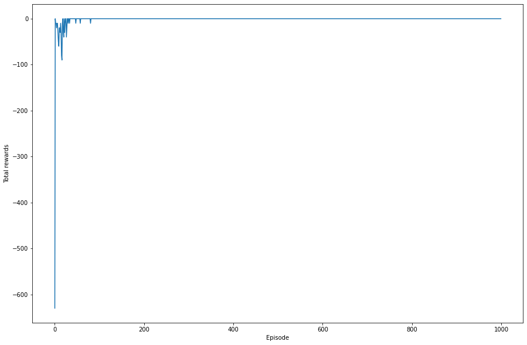
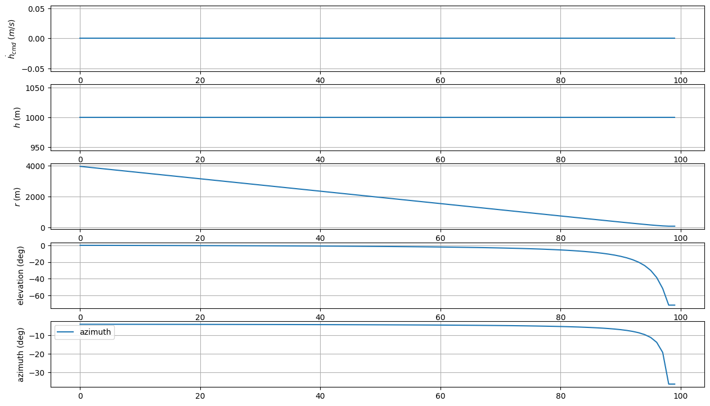
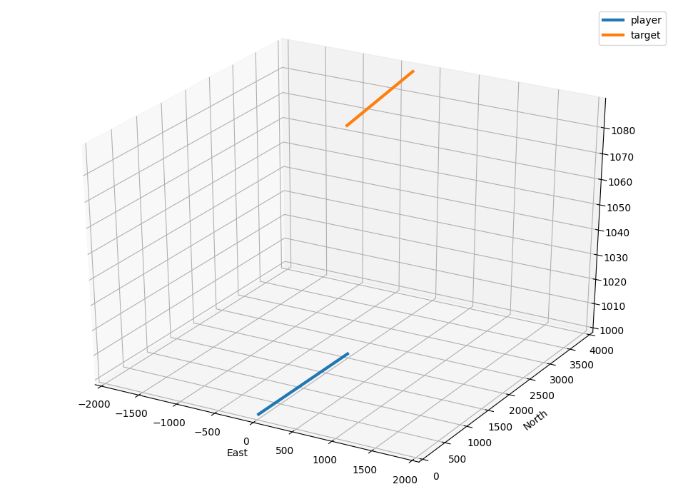
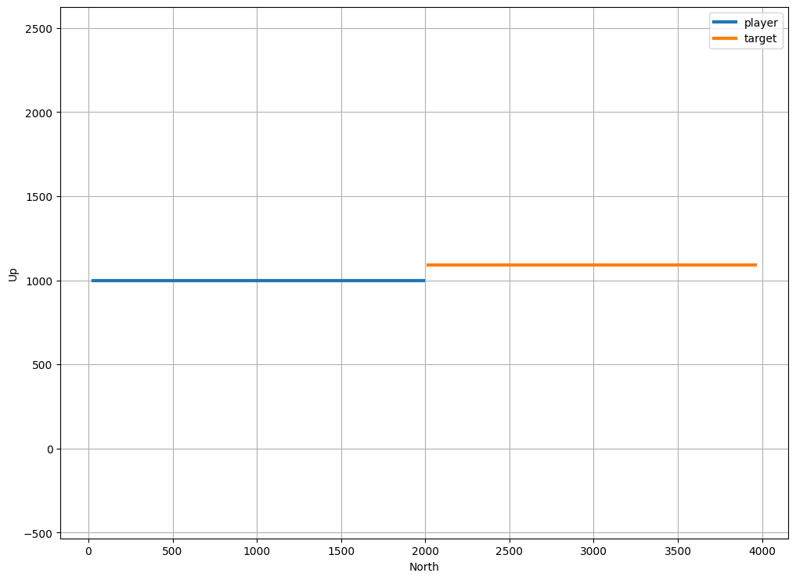

# non_cmd_rainbow
새롭게 Rainbow DQN을 적용하여 실험을 진행하였다. 환경 검증을 위해 먼저 고도변화를 주지 않는 실험을 진행하였다. Reward는 고도변화 명령을 줬을때는 고도 변화 명령값의 절대값에 -1을 곱하여 반환했고,
고도변화 명령을 주지 않은경우에는 0을 반환했다.

# 구현 결과

## Rewards after 1000 episodes 

## Results after 1000 episodes (hdot_cmd, h, r, elev, azim)

## 3D plot

## Height plot

결과를 보면, 이전과는 달리 1000개의 episodes만으로도 매우 이상적으로 수렴했음을 확인 할 수 있다. 따라서 이를 기반으로 아래 고도 명령을 주는 실험을 다시 진행하였다.

[7.down_cmd_rainbow](../7.down_cmd_rainbow)
