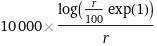
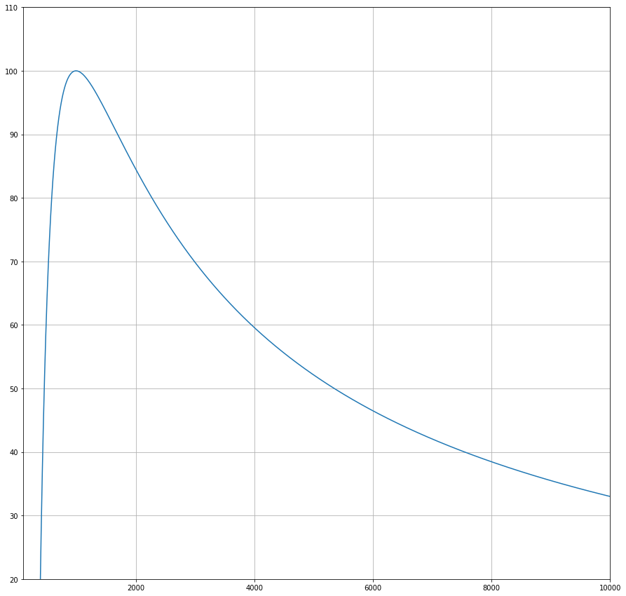
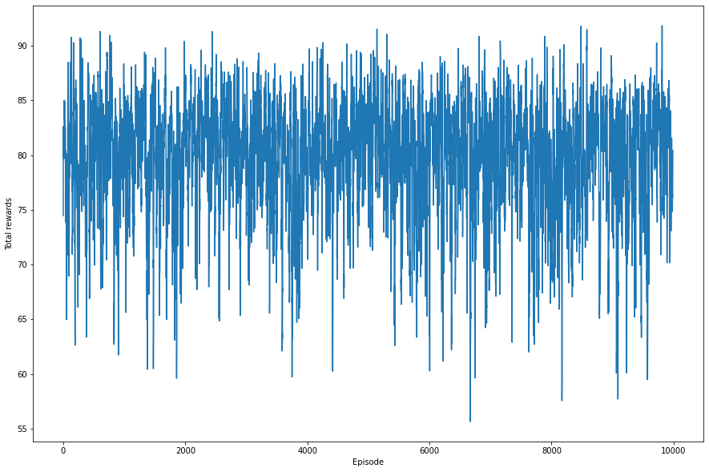
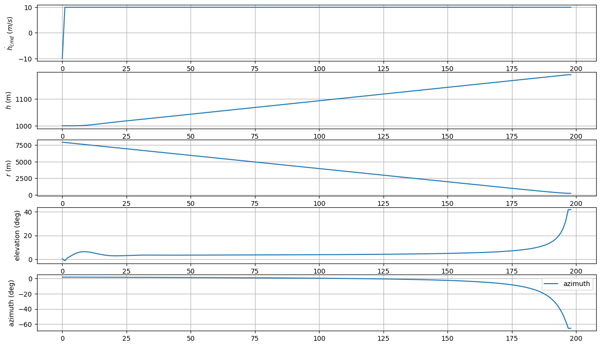
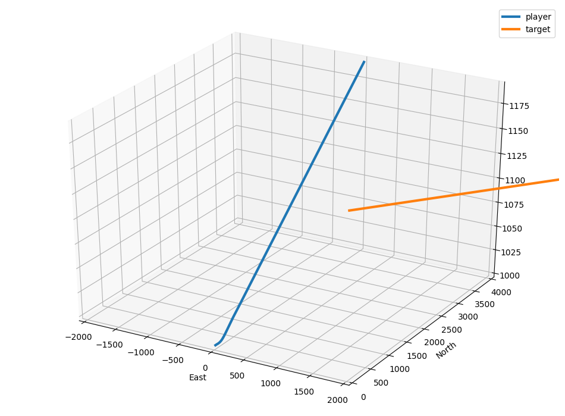
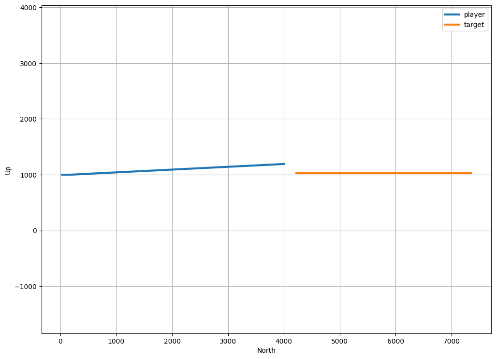

# down_cmd_min_dist
시작고도가 회피 방향에 영향이 미치도록, 회피 직후의 거리가 reward에 영향이 미치도록 수정하였다. 또한 회피 이후에 시야 밖에서 에피소드가 진행되면, 에피소드 종료시 거리가 회피 직후의 거리와는 달라지므로, 다시 상대기가 시야 밖으로 나가면 에피소드가 종료되도록 수정하였다. 최종적인 reward는 다음과 같다.

- 회피 시 : 

- 충돌 시 : 0

회피 시 reward를 그래프로 나타내면 다음과 같이 100(최소 회피거리)이후에 감소하는 형태로 나타난다.

## Reward function

좀 더 확실한 결과를 확인하기 위해 10000 episodes 를 진행하였다.

# 구현 결과

## Rewards after 10000 episodes (Moving average 10)

## Results after 10000 episodes (hdot_cmd, h, r, elev, azim)

## 3D plot

## Height plot

결과를 보면, 마찬가지로, 의도와는 달리 위로 회피가 진행되었다.

[9.min_dist_cmd_retry](../9.min_dist_cmd_retry)
