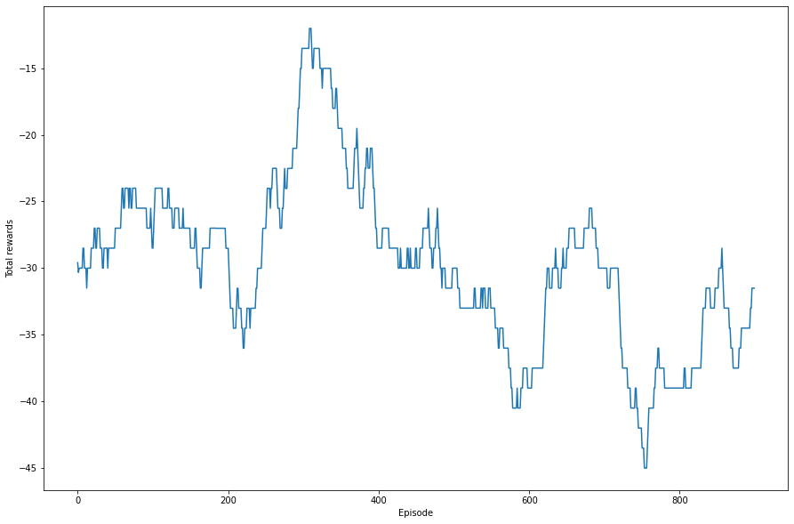
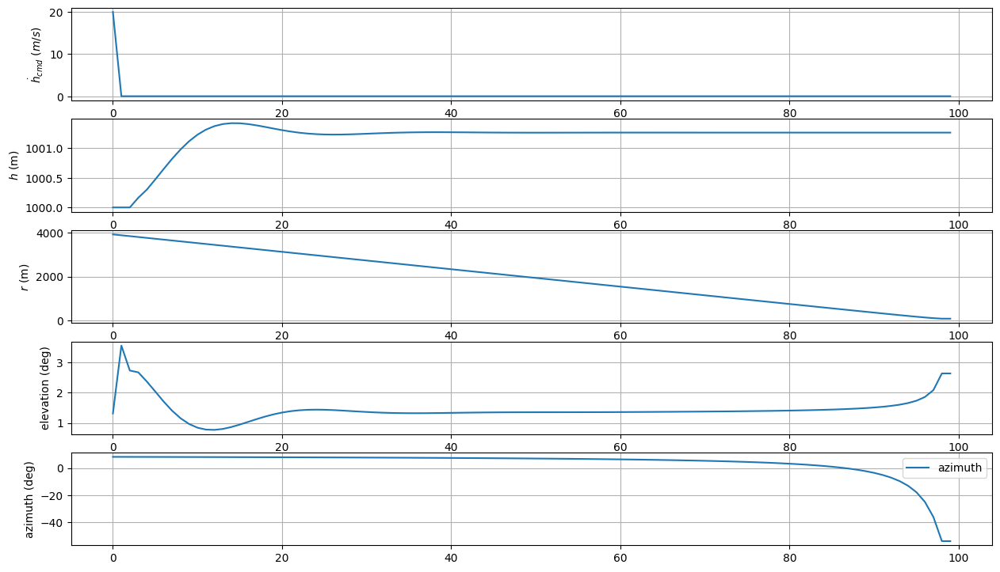
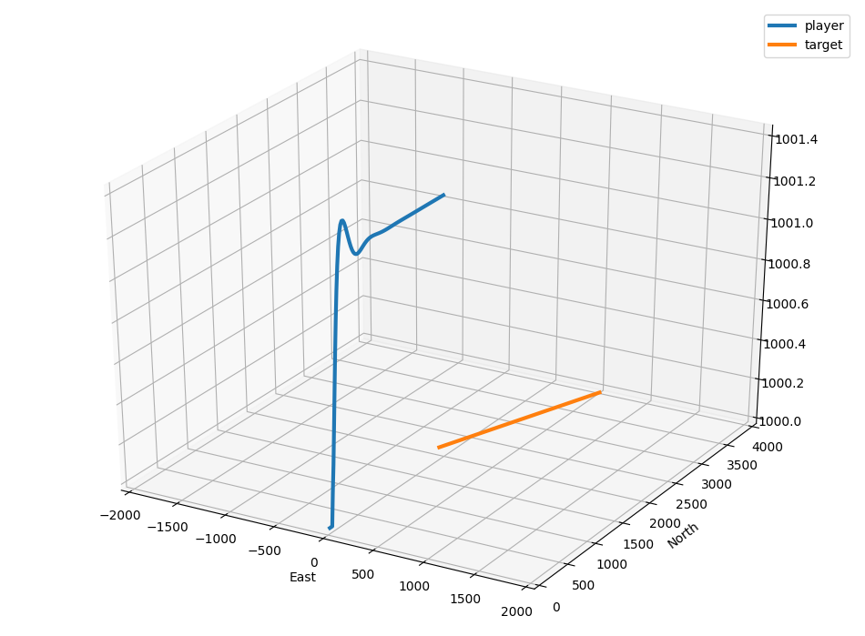
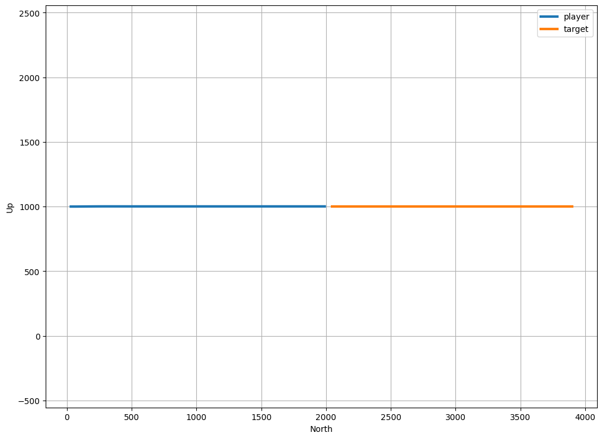

# must_col_env
이전에는 아래로만 회피하는 상황을 만들기 위해 상대기가 늘 본체보다 높은고도에서 출발하도록 되어있었다. 그러나 이 경우에 가만히만 있어도 회피되는, 즉 애초에 충돌하지 않는 상황이 발생하여, 이를 일단 동일고도로 수정하여 충돌하는 상황이 거의 대부분이도록 상황을 조정해 보았다.
 
 # 구현 결과
## Rewards after 1000 episodes (Moving average 100)

## Results after 1000 episodes (hdot_cmd, h, r, elev, azim)

## 3D plot

## Height plot

 
결과는 여전히 수렴되지 않는 상황이었다. 아예 회피후에 거리에 대한 최소거리 회피조건을 더 추가해볼까 하여 다시 실험해보았다.
 
 [11.min_dist_avoid](../11.min_dist_avoid)
