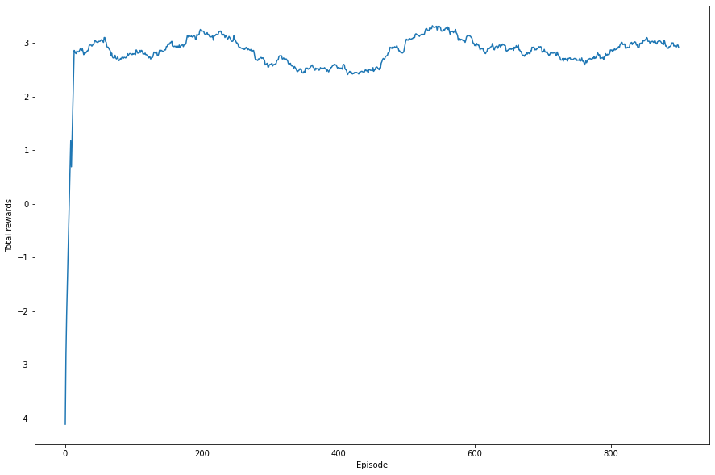
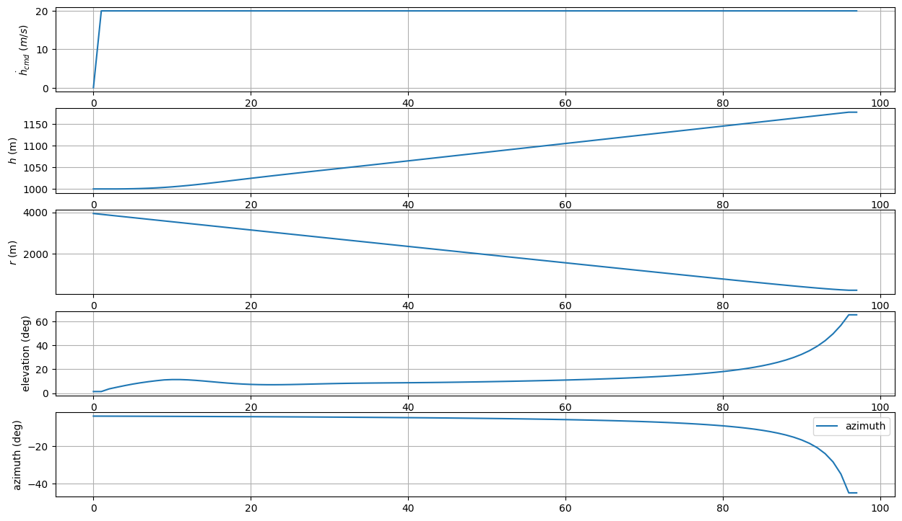
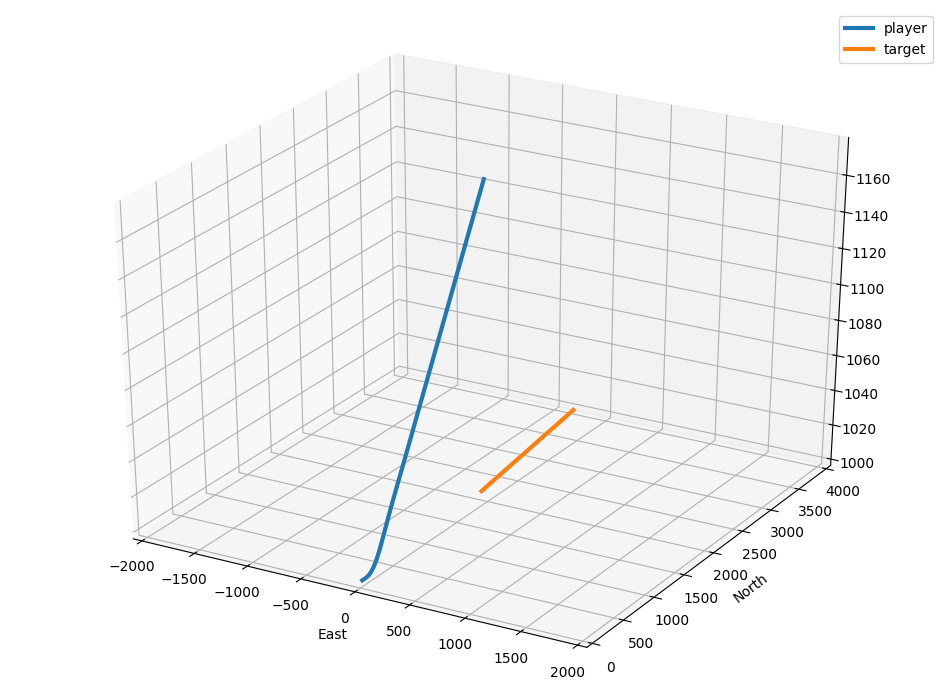
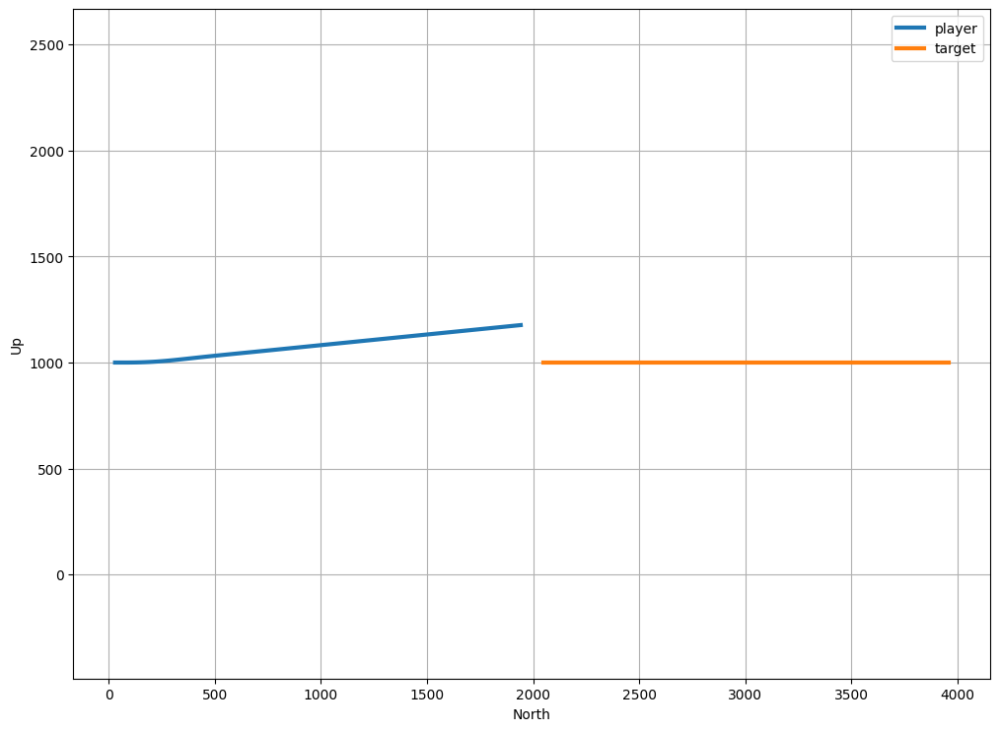

# reward_retry
이전과는 달리 매 스텝마다 hcmd의 절대값에 -0.05를 곱했던 reward를 아예 모두 합하여 에피소드가 끝날때 반환되도록 변경하였다. 또한 아예 정지해서 회피하는 경우에 대한 reward 역시 수정하였다. 변경한 reward는 다음과 같다.
 
 - 회피 시 100-(hcmd 총합)*0.05 의 reward 반환, 정지하여 회피한 경우 50-(hcmd 총합)*0.05 의 reward 반환
 - 충돌 시 -50-(hcmd 총합)*0.05 의 reward 반환
 
 # 구현 결과
## Rewards after 1000 episodes (Moving average 100)

## Results after 1000 episodes (hdot_cmd, h, r, elev, azim)

## 3D plot

## Height plot

 
결과는 아직 마찬가지로 원하는 결과를 얻지 못했다.. 다음으로는 여기에다가 최소거리 충돌에 대한 reward를 다시 한번 추가해보려 한다.
 
 [13.reward_retry_min_dist](../13.reward_retry_min_dist)
