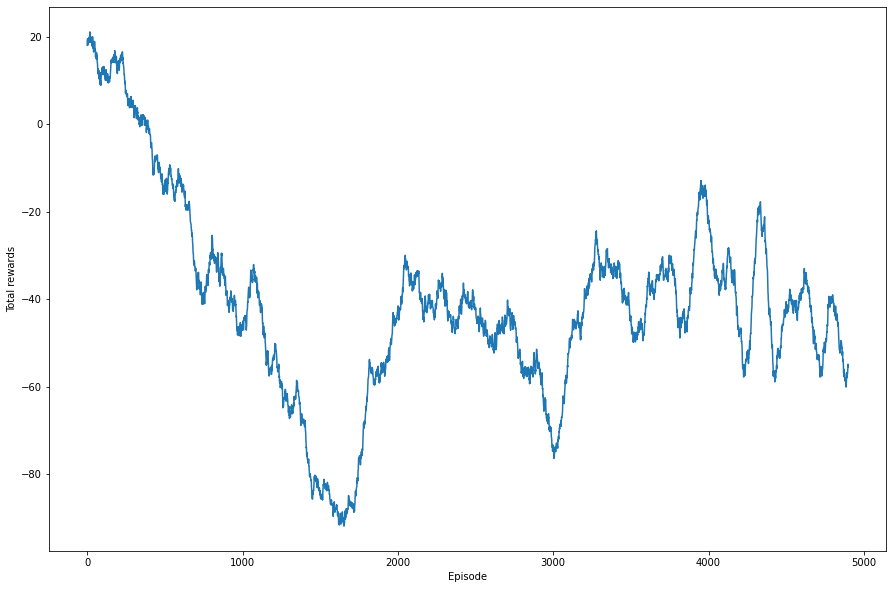
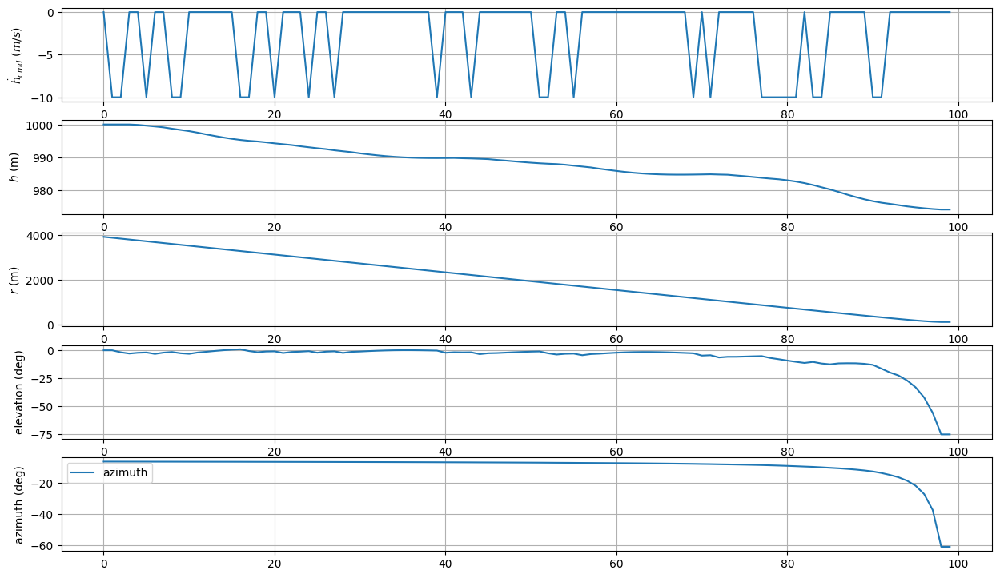
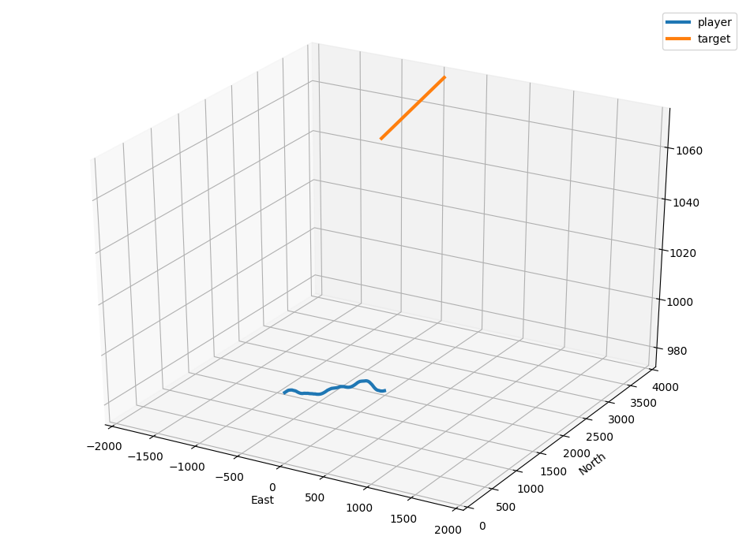
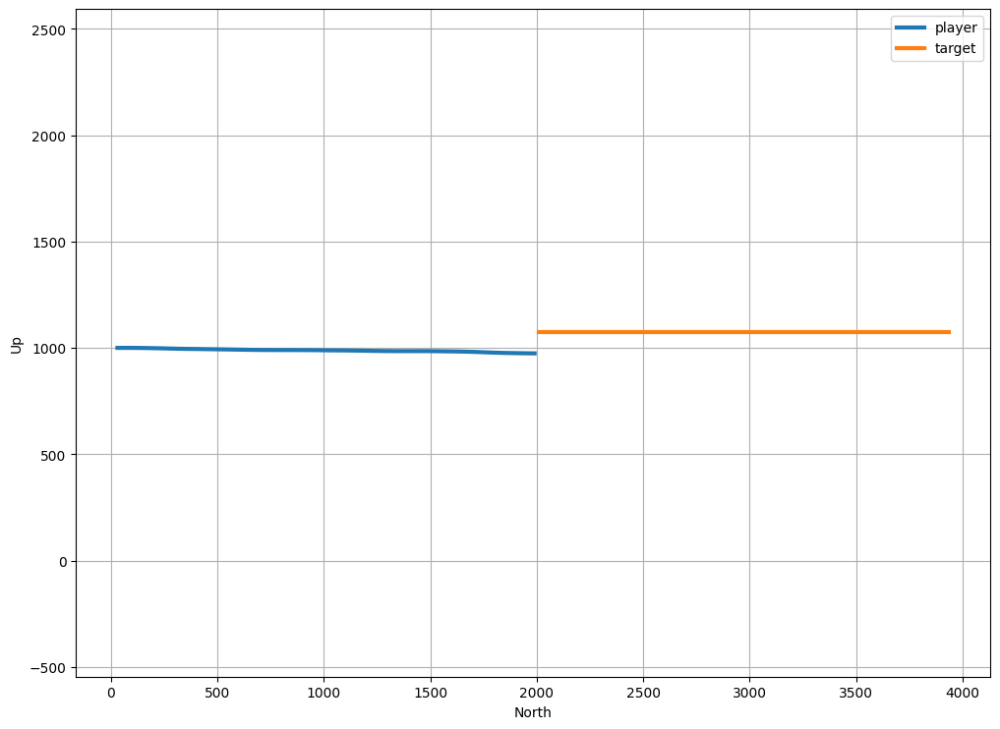

# reward_retry_add_time
 회피 기동의 단일성을 위해 reward에 time step term을 추가하였다. 이를 통해 hcmd 명령을 더 일찍 주는것이 더 높은 reward를 받도록 구현하였다. 수정한 reward는 다음과 같다.
 
 - 매 스텝마다 현재 -(time step) 를 곱하여 반환
 
 # 구현 결과
## Rewards after 5000 episodes (Moving average 100)

## Results after 5000 episodes (hdot_cmd, h, r, elev, azim)

## 3D plot

## Height plot

 
 여전히 수렴이 잘 진행되지 않았다. hcmd 앞부분의 계수를 조절하여 최적의 계수를 찾아보기 위해 해당 인자를 변수로 받도록 다시 구현해보았다.
 
 [15.hcmd_modulate](../15.hcmd_modulate)
