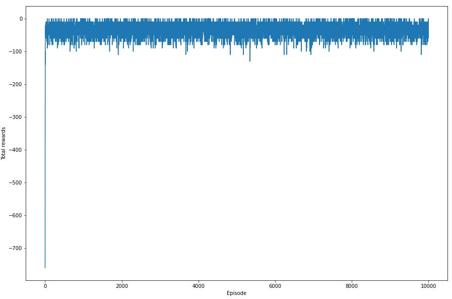
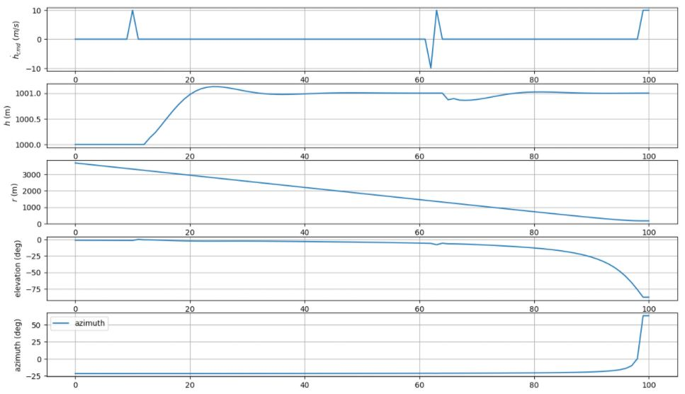
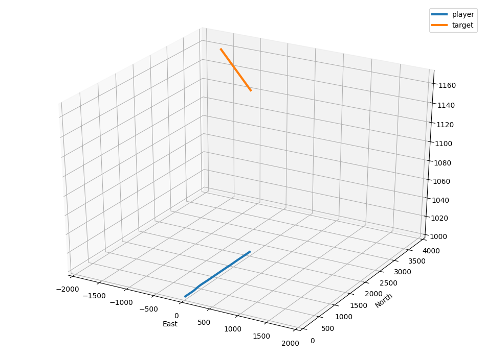
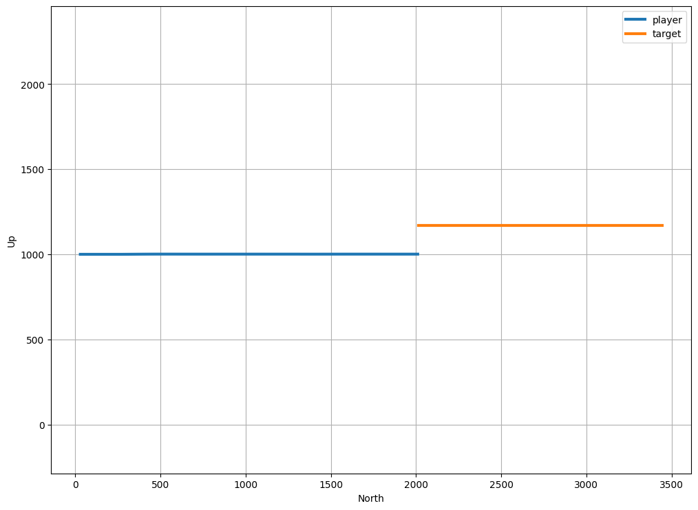

# non_cmd_dqn_step_reward
이전의 문제점을 해결하기 위해 새롭게 reward를 설정하였다. reward 변경내용은 다음과 같다.
- 고도 변화 명령값의 절대값을 누적으로 더한 값에 -1을 곱하여 반환 (에피소드 종료시에만 적용) -> 매 스텝마다 고도 변화 명령값에 -1을 곱하여 반환

# 구현 결과

## Rewards after 10000 episodes 

## Results after 10000 episodes (hdot_cmd, h, r, elev, azim)

## 3D plot

## Height plot

Reward와 Results 사진을 보면, 완벽하게 들어맞지는 않지만 수렴이 되었음을 확인 할 수 있었다. 따라서 이를 토대로 이번엔 환경을 변화시켜 아래로 회피기동 하는 것을 실험해보려 한다.

[3.down_cmd_dqn](../3.down_cmd_dqn)
