# Imitation_learning
 본 Repo는 항공기 충돌회피 보조시스템 학습을 위한 policy net의 구조를 실험하는 내용이다.
 [모방학습을 활용한 항공기 충돌회피 정책 네트워크 모델링.pdf](모방학습을%20활용한%20항공기%20충돌회피%20정책%20네트워크%20모델링.pdf) 에서 논문 내용을 확인 할 수 있다.

## Environment(Data) design
본체 시야 내부에 있는 항공기를 회피하는 것을 전제로 했기에, 상대기의 시작점은 본체의 이동방향에 대해 부채꼴 형식으로 +-50도 위치에서 출발하게 설정하였다.
본체는 NED 좌표계 기준 NE 평면의 (0, 0)에서 +N 방향으로 200의 속력으로 진행하고, 상대기는 (0, 2000) 기준 반경 2000의 부채꼴 형태로 (0, 2000)을 향해 200의 속력으로 접근하도록 되어있다.
본체의 고도는 NED 좌표계 기준 D = -1000에서, 상대기는 -1000 +- 200에서 시작한다.(강화학습용 시나리오에서는 +- 50 으로 변경된다.)
해당 내용을 간단하게 표현하면 아래 그림과 같다.

### Environment overview
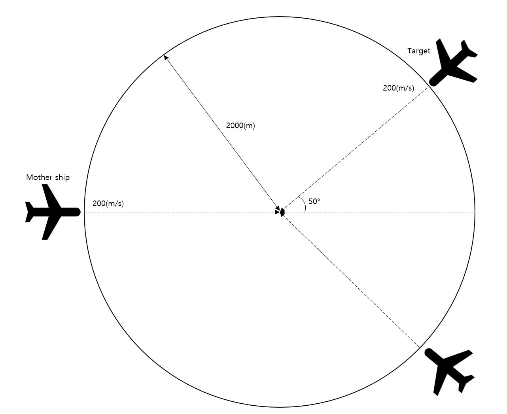

회피를 진행하기에 앞서, 항공기 기동의 동역학을 구현하였는데, 해당 기동에 대한 역학은 아래와 같은 제어루프로 설계하였다.

### Dynamics of controling aircrafts
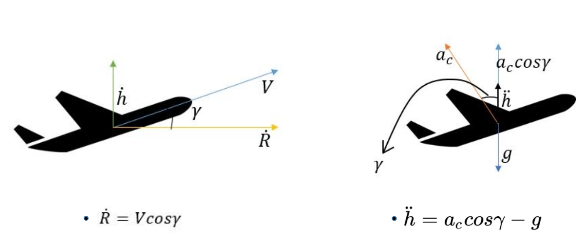
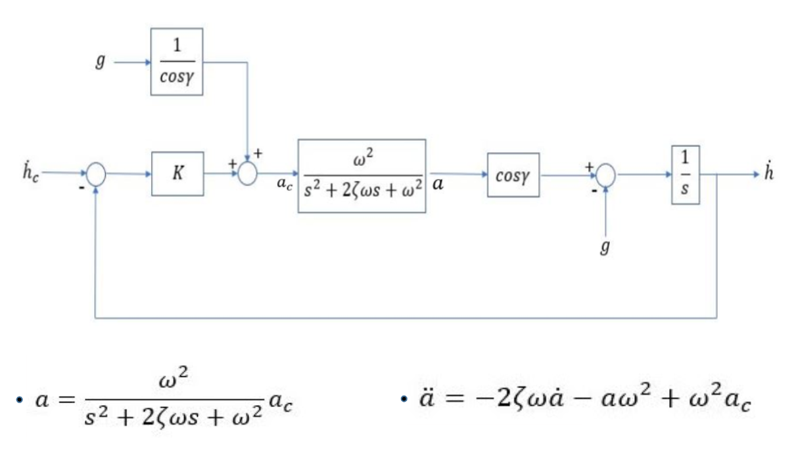

회피를 판단하는 기준은 총 5가지의 feature에 대한 연산으로 진행할 수 있도록 하였다. 5개의 feature는 아래와 같다.

- r : 본체와 상대기의 상대거리
- vc : 상대기의 접근속도(상대속도)
- los : Line of sight
- daz : Azimuth의 스텝 당 변화량
- dlos : Los의 스텝 당 변화량

5개의 feature들로는 해당 진행경로를 유지했을때, 상대기와의 예상 최소 수직거리(MDV, minimum distance of vertical)와 예상 최소 수평거리(MDH, minimum distance of horizontal)을 계산할 수 있었다. 여기에 기동을 푸는 조건을 위해 필요한 현재 상대기와의 고도차이(코드에선 dist_cruise로 표현하였다.)역시 계산 할 수 있었다.

### Calculate MDV, MDH and dist_cruise
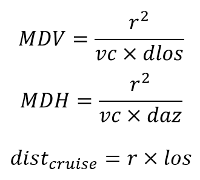

이 세가지 정보 (MDV, MDH and dist_cruise)로 회피 명령을 내릴지, 혹은 현재 경로를 유지할지를 매 순간마다 결정할 수 있는 닫힌 결정루프를(만약, 강화학습에 적용한다면 MDP를 기준으로 설계해야 하기 때문) 설계해야 했다. 설계한 결정루프의 구조에 대한 코드는 아래와 같다. 이때, 회피시 기동 명령(hcmd_dot)의 크기는 +-20으로 하였다. dist_sep는 항공기가 회피했다고 판단하는 최소 거리로 이 거리 이상을 벗어나야 회피했다고 판단한다.

### Python code of decision loop
```python
                if min_dist_vert>0:
                    if min_dist_vert<dist_sep:
                        if np.abs(dist_cruise)<dist_sep:
                            if (min_dist_horiz <dist_sep):
                                if hdot_cmd != -20:
                                    count_change_hdot+=1

                                hdot_cmd = -20
                            else:
                                hdot_cmd=0
                        else:
                            hdot_cmd=0
                    else:
                        if np.abs(dist_cruise)>dist_sep:
                            hdot_cmd = 0
                        else:
                            if hdot_cmd != -20:
                                count_change_hdot+=1
                            hdot_cmd = -20
                else:
                    if min_dist_vert>-dist_sep:
                        if np.abs(dist_cruise)<dist_sep:
                            if min_dist_horiz <dist_sep:
                                if hdot_cmd != 20:
                                    count_change_hdot+=1

                                hdot_cmd = 20
                            else:
                                hdot_cmd=0
                        else:
                            hdot_cmd=0
                    else:
                        if np.abs(dist_cruise)>dist_sep:
                            hdot_cmd = 0
                        else:
                            if hdot_cmd!=20:
                                count_change_hdot+=1
                            hdot_cmd=20
```
                            
이렇게 구현된 환경을 토대로 학습시키기 위해서는, 비행기가 어떤 상황의 어떤 순간에던 적용이 가능하도록, 데이터를 뽑을때 랜덤한 time step에서 랜덤하게 샘플을 추출할 필요가 있었다. 따라서 하나의 에피소드의 전체 time line 에서 랜덤한 time step 지점을 뽑아 샘플로 만들었다. 각 데이터 샘플은 네트워크의 입력으로 들어갈 5개의 feature (r, vc, los, das, dlos)와 그때 비행기에게 내려야할 고도변화 명령(hdot_cmd)로 구성되었다.
생성한 데이터는 train data 300000개, test data 90000개의 총 390000개의 데이터를 생성하였다.

## Network modeling (colision_avoidance_net_idx.py, train.sh, train_idx.sh)
회피 기동을 학습하기에 가장 적합한 network의 구조를 찾기 위해, 먼저 network의 구조를 3개의 FC(Fully connected) layer로 구성된 block으로 구현하였다. 각 block은 node 개수와 layer 개수를 입력값으로 주면, 해당 입력값에 맞게 모델을 구현하도록 설계하였다. 

### Network model with 3blocks

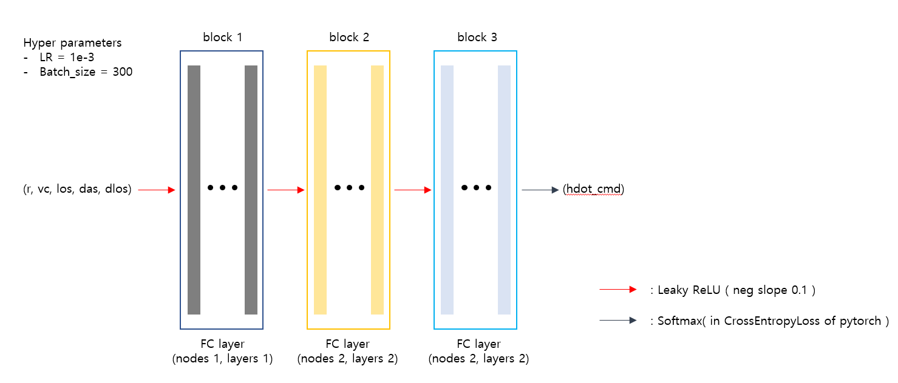

각 block의 node와 layer를 자동으로 입력받아 실험결과를 저장하도록 train.sh와 train_idx.sh의 두개의 bash script를 작성하여 실행시켰다. 실험내용의 범주는 아래와 같다. 각 실험내용은 총 4회씩 진행되었다. 학습에 대한 hyper parameters는 위의 network model 이미지에 작성된 내용대로 진행하였다.

- Layer : [1, 1, 1] , [2, 2, 2]
- Node : [20-80(interval 20), 20-80(interval 20), 20-80(interval 20)]

#### Additional experiments
##### Exp 1.
- Layer : [1, 1, 1]
- Node : [5, 5, 5]
##### Exp 2.
- Layer : [1, 1, 1] , [2, 2, 2]
- Node : [10, 10, 10]

결과를 분석하기 위해 초기에는 각 모델에 대한 test 결과를 토대로 5가지 요소에 대한 분석을 진행하려했다. 해당 요소들은 아래와 같다.
- Down command error
- UP command error
- Stay command error
- Minimum distance on all episode time steps
- Number of model parameters

각 요소들 별로, 4회의 실험에 대한 표준편차와 평균값을 계산하여 평가 요소에 반영하려 계산하였으나, error의 최대값이 2였고, 거의 command 오류가 발생하지 않아 error 요소를 제외하고, 아래의 두 요소(minimum distance on all episode time steps, number of model parameters)로 최적의 네트워크를 판별하였다. minimum distance on all episode time steps 요소를 줄여서 min_dist 라고 표현하겠다.

##

여기서 min_dist 요소가 실험마다 편차가 높은것은 torch의 random seed마다 수렴이 달라진다는 의미로, under fitting의 가능성이 있다고 판단하여, min_dist의 표준편차 역시 평가요소에 반영하였다. 해당 내용에 대한 모든 결과는 [std_df_fix.csv](std_df_fix.csv) 에서 확인할 수 있다. (여기서 min_dist가 mean_dist로 표현되었는데, 이는 4회의 실험에 대한 min_dist의 평균치이다.)

총 세가지 요소 (min_dist, 표준편차, number of model parameters)에 대해, 각각의 가중치를 0.8, 0.1, 0.1로 두어 계산한 결과 최종 모델은 node = [40, 20, 60], layer = [2, 2, 2] 이 되었다. 해당 가중치 계산 결과는 [compare_sum_df_fix.csv](compare_sum_df_fix.csv) 에서 확인할 수 있다.

### Result of final model structure
#### Confusion matrix of result
 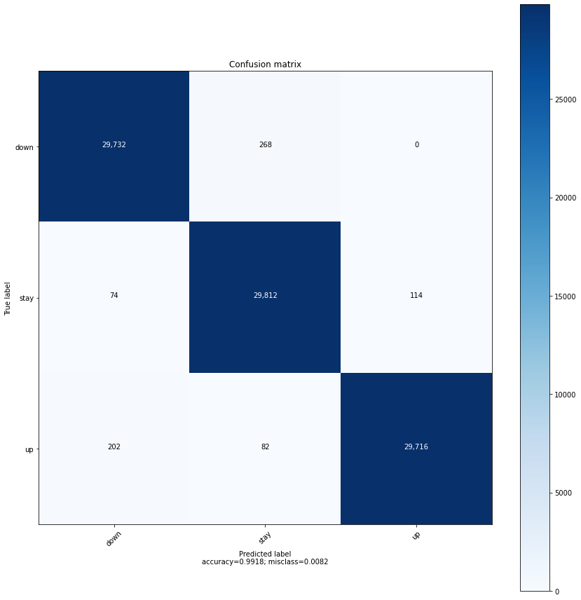

#### Avoid down simulation path result
 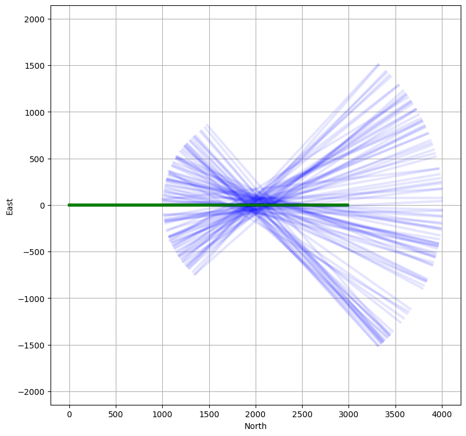
 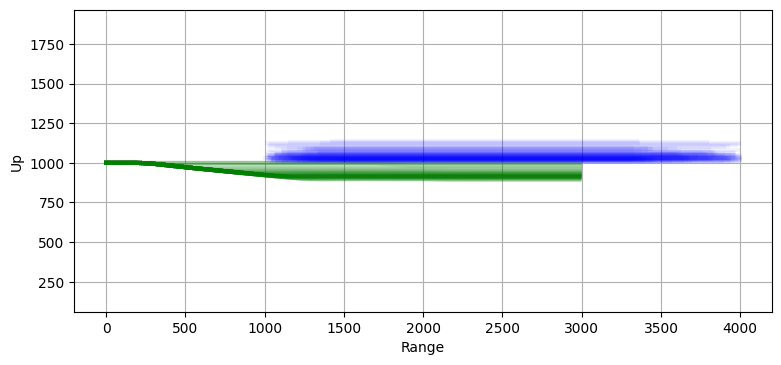

#### Avoid down simulation distribution result(minimum approach distance)
 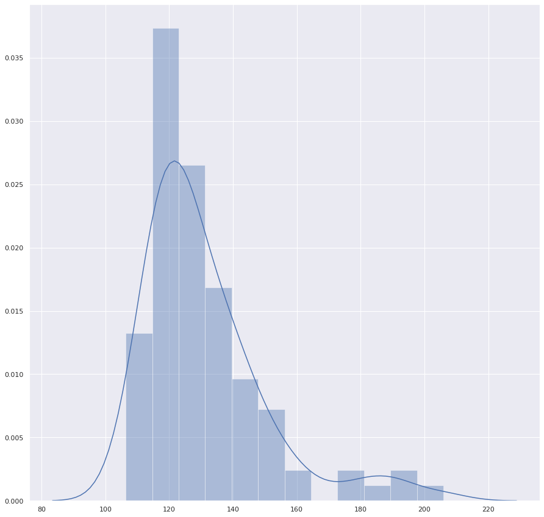

#### Avoid up simulation path result
 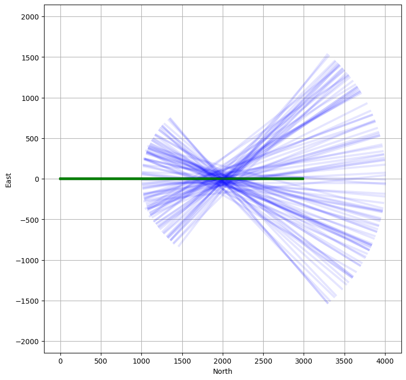
 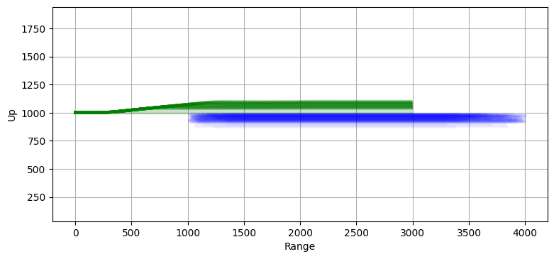

#### Avoid up simulation distribution result(minimum approach distance)
 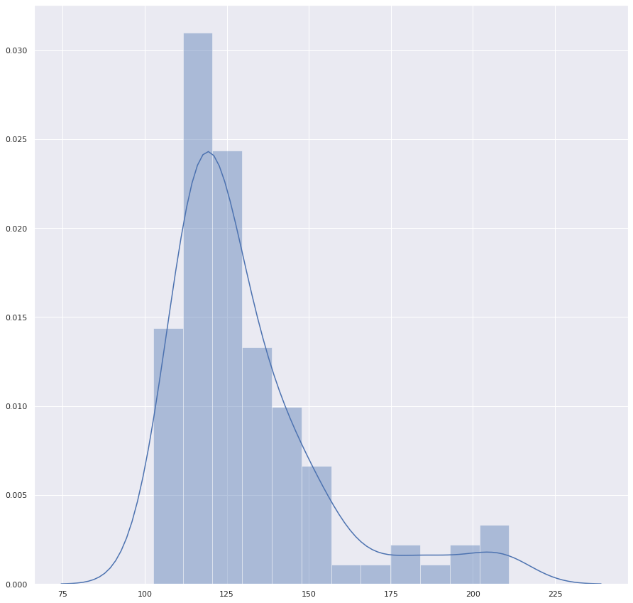

#### Not Avoid simulation path result
 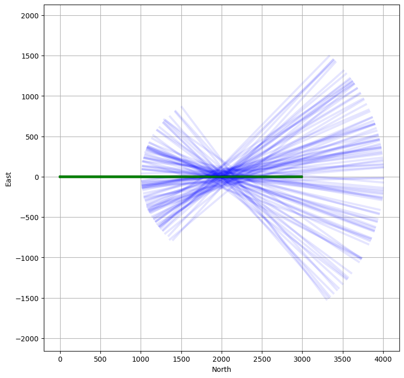
 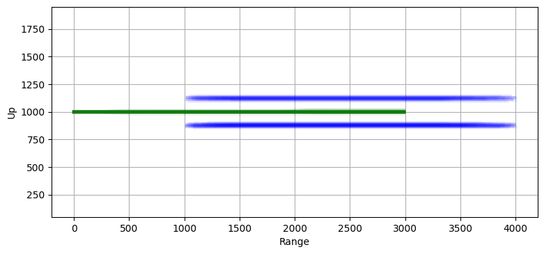

#### Not Avoid simulation distribution result(minimum approach distance)
 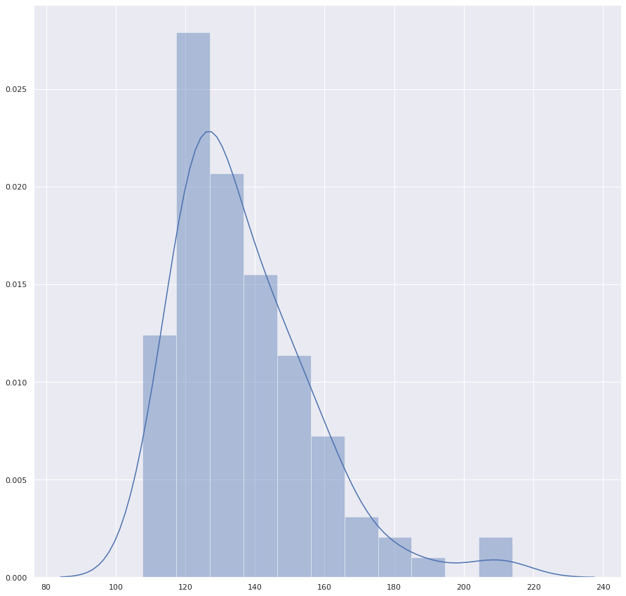
 
##
Confusion matrix의 결과를 보면, False positive와 True negative가 조금씩 나오는것을 볼 수 있는데, 이에 대한 결과를 확인해본 결과 위로 명령을 줘야하는데 아래로 주는경우, 혹은 그 반대의 경우의 오류는 상대기의 고도가 본체의 고도와 거의 동일해 위로 회피하거나 아래로 회피하는 선택의 차이가 없는 경우에 발생했다. 이에 대한 전체 error data는 [overall_error_df.csv](./data_number_test/overall_error_df.csv)에서 확인 할 수 있다. 또한 회피를 해야하는데 정지해있는 경우는 상대기와의 거리가 아주 가깝거나, 혹은 아주 먼 경우, 즉 데이터 분포상 드물게 발생하여 학습에 큰 영향을 주지 못한 data들이었다. 정지명령에 대한 error data는 [stay_error_df.csv](./data_number_test/stay_error_df.csv)에서 확인 할 수 있다.
##

추가적으로 train dataset의 크기에 따라 어느정도의 dataset만으로도 충분한 학습이 가능한지 확인하기 위해, dataset의 갯수를 다르게 하여 학습을 진행해보았다. 결과는 다음과 같다.

#### Accuracy by number of datas
 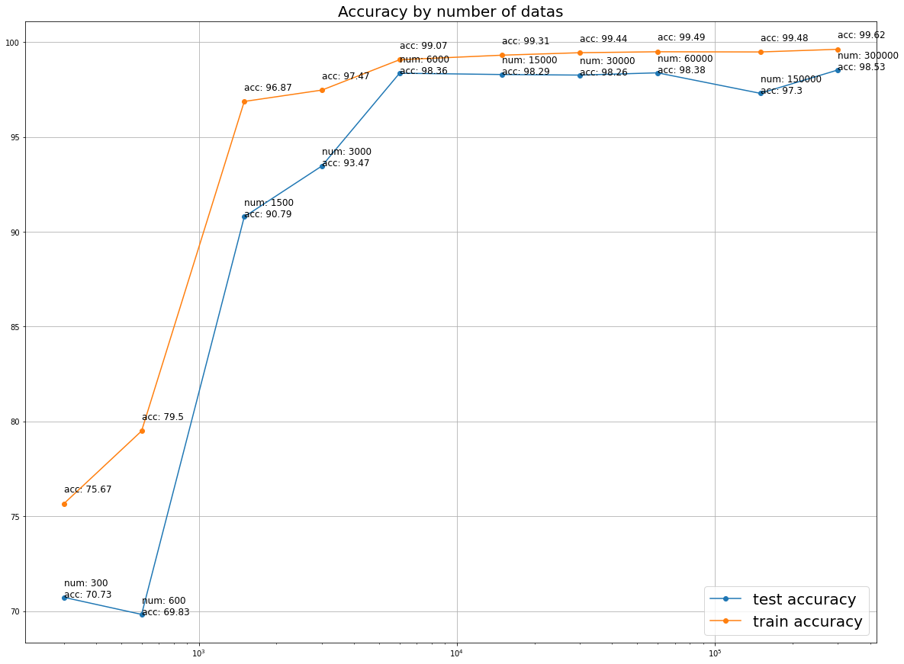

