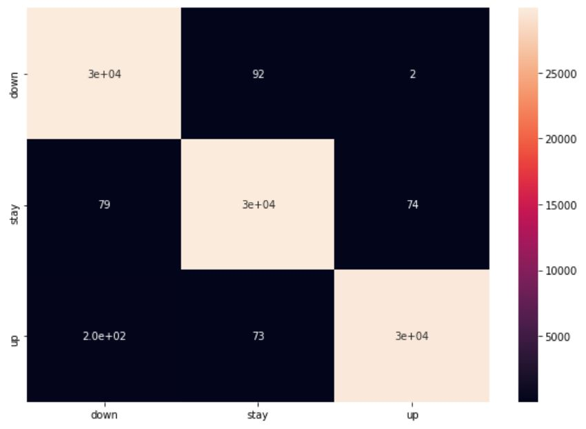
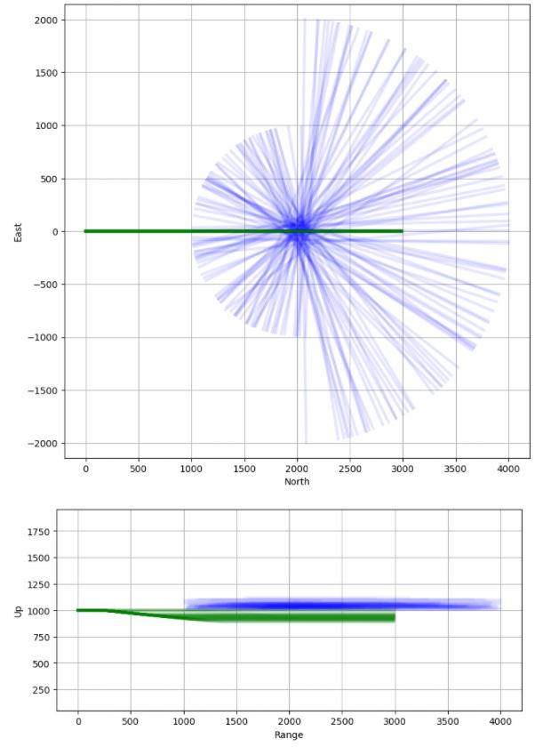
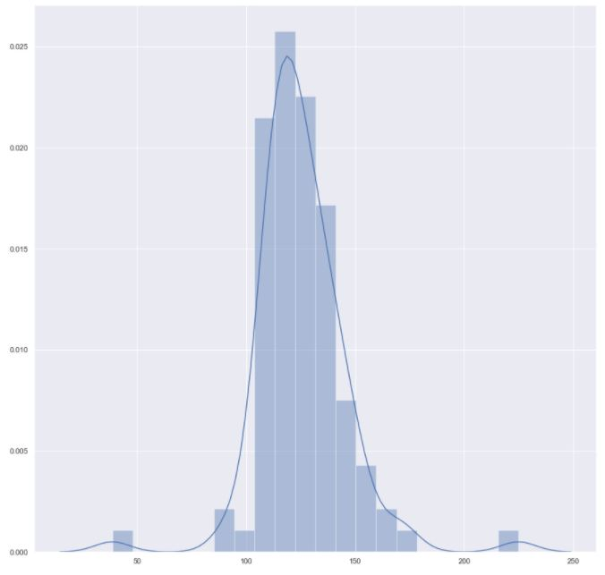
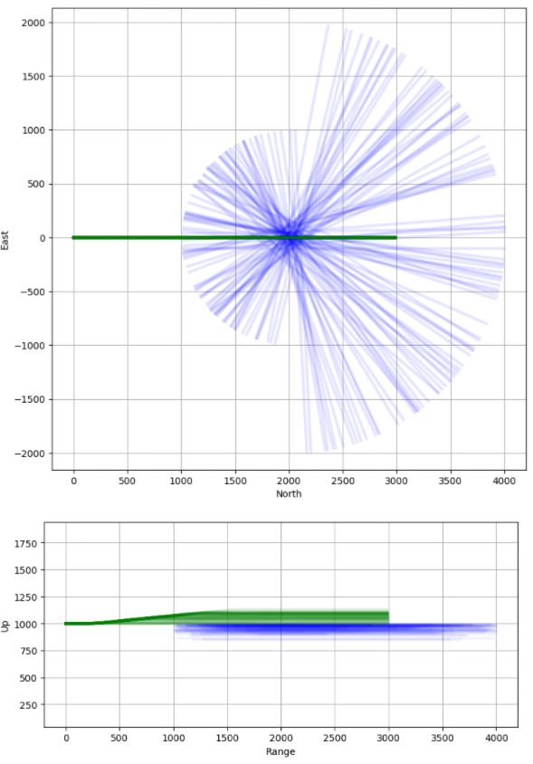
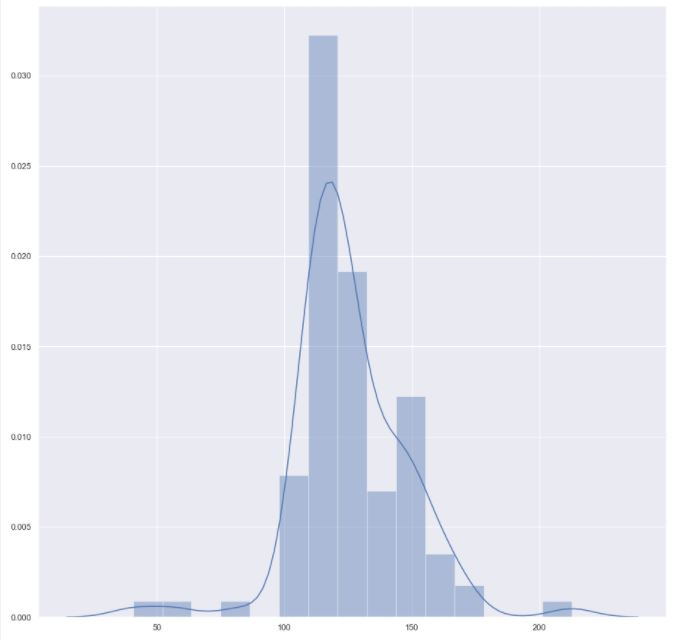
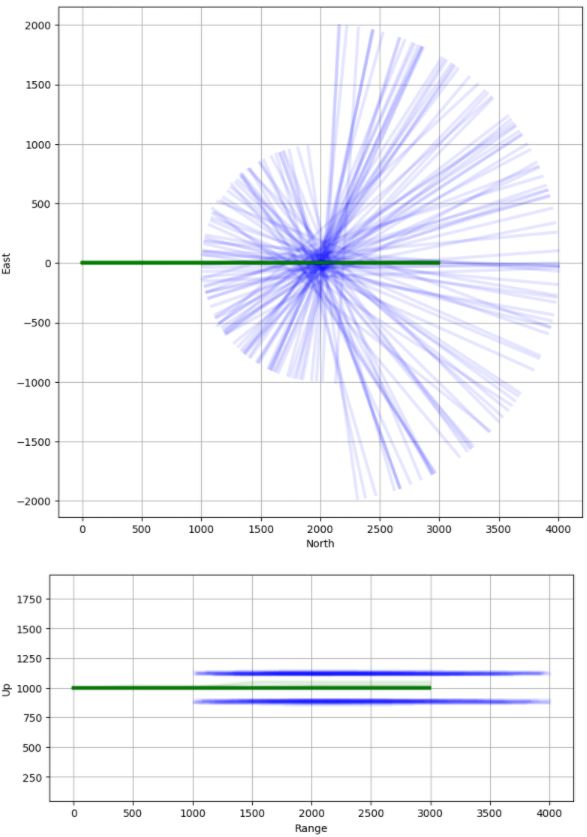
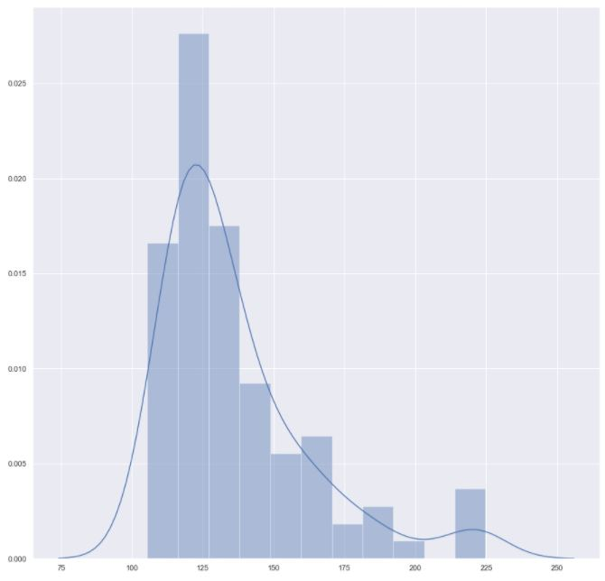

## Aircraft_avoidance_policy_net
 본 내용은 항공기 충돌회피 보조시스템 학습을 위한 policy net의 구조를 실험하는 내용이다.

 ## 구현 내용
 먼저 datagen.py를 이용하여 train과 test 데이터를 각 30만, 9만개씩 만들었다. 이때의 데이터는 입력 feature 5개(본체와 상대기체와의 상대거리(r), 본체와 상대기체와의 접근속도(vc), 본체와 상대기체와의 LOS(Line of Sight), 본체와 상대기체와의 Azimuth, Los의 변화량(dLOS), Azimuth의 변화량(dAzim))과 출력은 고도변화 명령(hdot_cmd)로 주어진다.
 항공기 본체는 주어진 데이터로부터 고도변화 명령에 대해 학습하여 기동하도록 하는것이 목적이다. 고도변화 명령은 총 세가지로, +20, 0 -20을 줄 수 있다.

 colision_avoidance_net_test.ipynb에 나온 코드처럼, 세가지 블록으로 나누어 네트워크를 설계했고, 40노드를 가진 2x3층짜리(각 블록에 2개의 층이 구성되어있고, 총 3개의 블록) FC layer로 모델을 구성했다. 이때 학습된 결과는 test 셋에 대하여 99프로의 정확도로 수렴하였다. 아래 그림은 학습 결과에 대한 Confusion matrix이다. 가로축이 출력값, 세로축이 타겟데이터를 의미한다.
 ### Confusion matrix of result
 

 해당 학습 결과를 토대로 다음과 같이 세개의 블록으로 나뉘어져 있던 모델을 하나의 6층짜리 FC layer로 병합하여 colision_avoidance_net_fin 에서 재학습시켰다.
 ```python
 class Model(torch.nn.Module):
     def __init__(self):
         super(Model, self).__init__()
         self.fc = nn.Sequential(
             nn.Linear(5, 40),
             nn.LeakyReLU(0.2, inplace=True),
             nn.Linear(40, 40),
             nn.LeakyReLU(0.2, inplace=True),
             nn.Linear(40, 40),
             nn.LeakyReLU(0.2, inplace=True),
             nn.Linear(40, 40),
             nn.LeakyReLU(0.2, inplace=True),
             nn.Linear(40, 40),
             nn.LeakyReLU(0.2, inplace=True),
             nn.Linear(40, 40),
             nn.LeakyReLU(0.2, inplace=True),
             nn.Linear(40, 40),
             nn.LeakyReLU(0.2, inplace=True),
             nn.Linear(40, 3)
         )

     def forward(self, x):
         x=x.view(batch_size//num_gpus,-1)
         out=self.fc(x)
         return out
 ```

 ## 결과 확인
 구현된 결과는 아래로 회피해야 하는 경우, 위로 회피해야 하는 경우, 회피가 필요없는 경우를 나눠서 각각 Down_col_data.ipynb, Up_col_data.ipynb, Non_col_data.ipynb 에서 실험을 진행하였고, 결과는 아래와 같다.

 ### Avoid down simulation path result
 

 ### Avoid down simulation distribution result(minimum approach distance)
 

 ### Avoid up simulation path result
 

 ### Avoid up simulation distribution result(minimum approach distance)
 

 ### Not Avoid simulation path result
 

 ### Not Avoid simulation distribution result(minimum approach distance)
 
