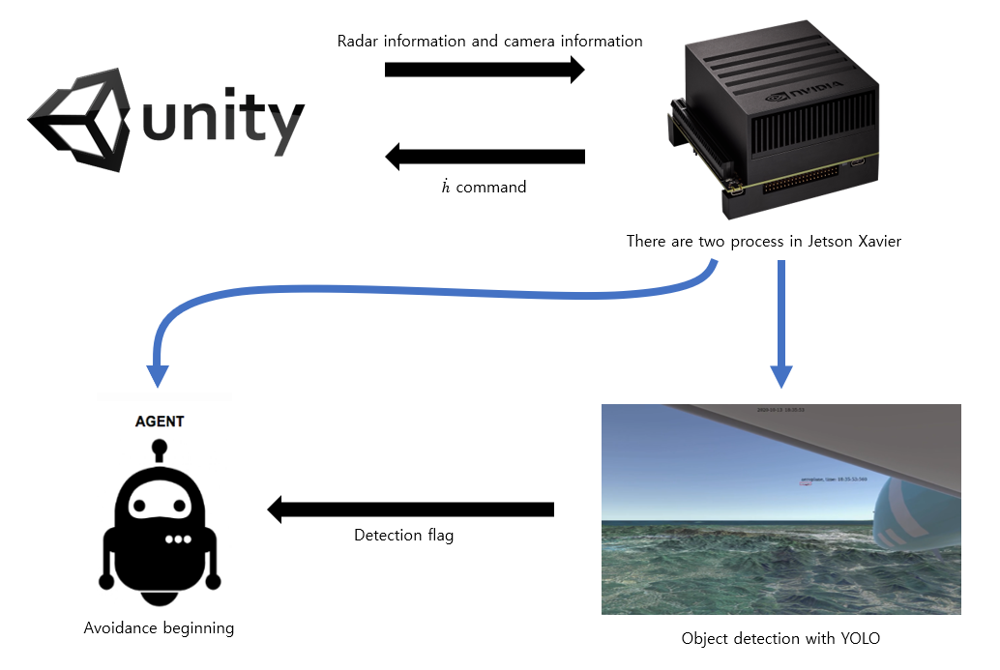

# collision_avoidance
Aircraft detection and Collision avoidance

| Directory | Contibutors | External Links |
| --- | --- | --- |
| [Aircraft_avoidance_policy_net](Aircraft_avoidance_policy_net) | 박건우 |
| [Aircraft_avoidance_RL](Aircraft_avoidance_RL) | 박건우 |
| [Aircraft_detection](Aircraft_detection) | 이효건 | [results (notion)](https://www.notion.so/0a2f0a99d296481a835b91e44be43149?v=446672df0798481eab056e5cc5906e9e)
| [UDP_jetson](UDP_jetson) | 박건우 |
| DBPAS | 인하대학교 | https://drive.google.com/file/d/1IMLpdmeMIFQ4wNjOqwPxfTnxNvAgnTA8/view?usp=sharing |

# Purpose of this research
본 연구의 목적은 강화학습을 사용하여 무인기의 충돌 회피 알고리즘을 학습시키는 것이다. 입력으로는 레이더 데이터 입력값과 카메라 입력값 두개가 주어지고, 카메라에 상대기가 detect되면, 회피기동을 시작하도록 고도 변화 명령을 출력으로 내보낸다. 먼저 현재까지(2020-10-20) YOLOV3 알고리즘을 사용한 object detection 알고리즘과 Supervised Learning을 이용하여 학습시킨 모델을 Jetson xavier에 동시에 얹은 상황까지 구현이 진행되었다. 추후 구현될 내용은 다음과 같다.

- YOLOV3 알고리즘의 detection flag를 회피 기동 모델과 연결한다.
- YOLOV3 알고리즘의 detect 성능을 높이기 위해 알고리즘을 조정한다.
- 기존 supervised learning 된 모델을 기반으로 적합한 강화학습 Agent를 학습하여 기존 모델을 대체한다.

## Overview of this research

현재까지 구현된 내용의 영상은 아래 링크와 같다.

https://youtu.be/hm3EEg3RjYE

