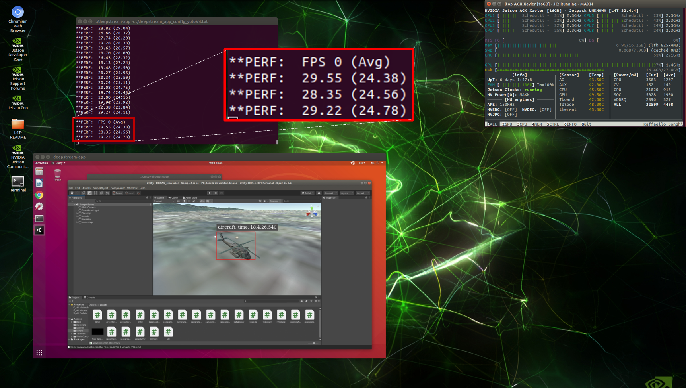
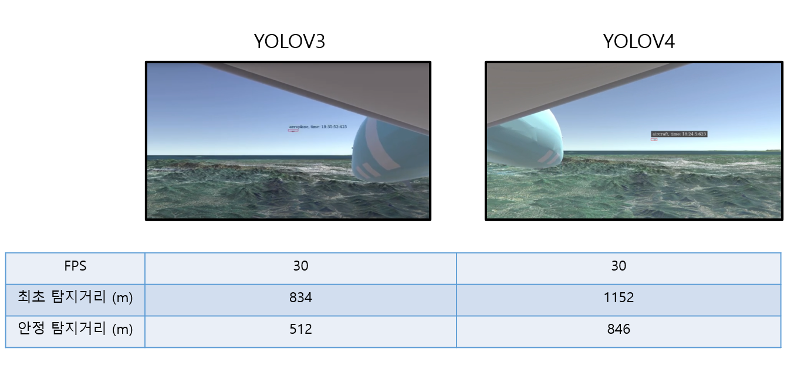
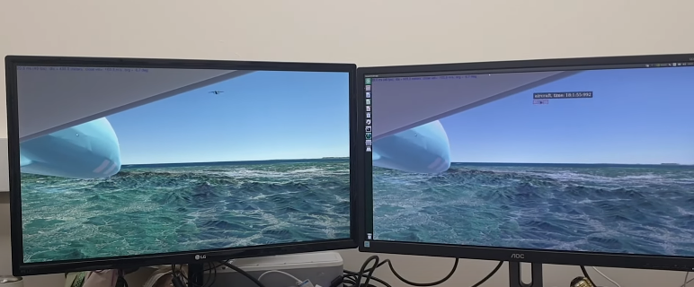

# collision_avoidance
Aircraft detection and Collision avoidance

| Directory | Contibutors | External Links |
| --- | --- | --- |
| [Aircraft_avoidance_policy_net](Aircraft_avoidance_policy_net) | 박건우 |
| [Aircraft_avoidance_RL](Aircraft_avoidance_RL) | 박건우 |
| [Aircraft_detection](Aircraft_detection) | 이효건 | [results (notion)](https://www.notion.so/0a2f0a99d296481a835b91e44be43149?v=446672df0798481eab056e5cc5906e9e)
| [UDP_jetson](UDP_jetson) | 박건우 |
|[YOLOV4 Deepstream](custom_deepstream) | 박건우 |
| DBPAS | 인하대학교 | https://drive.google.com/file/d/1IMLpdmeMIFQ4wNjOqwPxfTnxNvAgnTA8/view?usp=sharing |

# Purpose of this research
본 연구의 목적은 강화학습을 사용하여 무인기의 충돌 회피 알고리즘을 학습시키는 것이다. 입력으로는 레이더 데이터 입력값과 카메라 입력값 두개가 주어지고, 카메라에 상대기가 detect되면, 회피기동을 시작하도록 고도 변화 명령을 출력으로 내보낸다. 본 연구의 간략한 overview는 아래와 같다.
## Overview of this research

먼저 YOLOV3 알고리즘(Deepstream, https://developer.nvidia.com/deepstream-getting-started) 을 
사용한 object detection 알고리즘과 Supervised Learning을 이용하여 학습시킨 모델을 Jetson xavier에 동시에 얹어 결과를 확인해 보았다. 해당 결과는 아래 링크를 참고하라.

## YOLOV3 with Collision avoidance model (Not communicated)
https://youtu.be/hm3EEg3RjYE

YOLOV3의 Detection 성능이 그리 좋지 않아, YOLOV4 알고리즘을 Deepstream으로 최적화하여 다시 실험을 진행하였다. 해당 결과는 아래 링크를 참고하라.

## YOLOV4 with Collision avoidance model (Not communicated)
https://youtu.be/rDMvdwizSz4

YOLOV4의 Detection 성능이 기존의 YOLOV3에 비해 월등히 뛰어남을 확인 할 수 있다. 또한 FPS역시 25-30 프레임 정도로 높은 FPS 결과를 보였다.

## YOLOV4 FPS on Jetson Xavier

## Compare YOLOV3 VS YOLOV4

YOLOV4를 얹은 상태에서 Delay를 확인한 결과 영상은 아래 링크를 참고하라.

## YOLOV4 Delay Check
https://youtu.be/8QWvEw6UdAg

이후에 Detection되는 class의 갯수를 aeroplane으로 줄이고 False Positive를 수정하자 Detection성능이 더욱 좋아졌다. 또한 이에 회피기동 알고리즘을 Detection Flag를 받으면 실행하도록 구현하였다.

결과는 아래 링크를 참고하라.

## YOLOV4 with Collision avoidance model (Communicated)
https://youtu.be/NvdkXGV38Dw

추후 진행될 연구는 다음과 같다.
- 기존 supervised learning 된 모델을 기반으로 적합한 강화학습 Agent를 학습하여 기존 모델을 대체한다.

